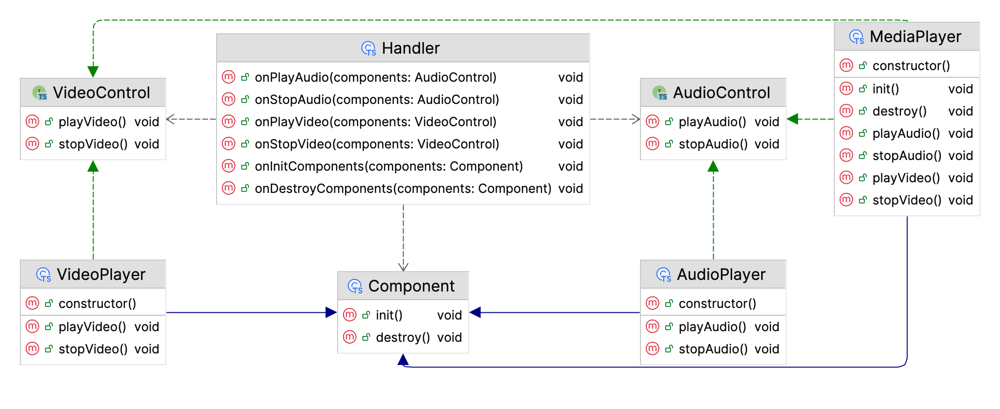

# File System: Applying the LSP

The goal of this task is to assess your ability to apply the LSP in TypeScript.

Duration: *30 minutes*

## Description

You are provided with TypeScript code representing a file system.

The code violates the LSP in two ways:
1) The `ImageFile` class introduces a new precondition in the `open` method. It can only be opened in `read` mode and throws an error otherwise. When a `FilesProcessor` instance attempts to open such a file in `write` mode along with other instances of the `File` class, this causes the system to break. This violates the LSP because a subclass introduces unexpected behavior that breaks the program when a subclass object is used in place of a superclass object.

2) `TextFile` changes the default value of the `mode` argument of the `open` method to `write` instead of `read` by default. This also violates the LSP because a subclass introduces unexpected behavior that might break the system when users assume that all instances of the `File` class will be opened in `read` mode by default.

Refactor the code to adhere to the LSP:

## Requirements

1) In the method `open` of the `TextFile` class, change the value of the argument `mode` to the value `read` by default. This way, the class will adhere to the LSP by not introducing unexpected behavior in a subclass.

2) Introduce the `canBeOpenedInWriteMode` method in the `File` class so that subclasses can allow/disallow files to be opened in `write` mode. If there is an attempt to open a file in `write` mode and the method returns `true`, then initiate opening of the file in `write` mode. Otherwise, fall back to opening the file in `read` mode. Instances of the `File` class should only be able to open files in `read` mode.

3) After refactoring, refactor the `ImageFile` class accordingly. This way, instances of it will no longer throw exceptions. This will comply with the LSP, as the app won't break because of an error thrown during an attempt to open an image file in `write` mode.

4) Extend the logic of the `TextFile` class to allow files to be opened in `write` mode only if the file size is less than `1024`.

## Examples

Below is an example:

```typescript
import { TextFile } from './TextFile';
import { ImageFile } from './ImageFile';
import { FilesProcessor } from './FilesProcessor';

const filesProcessor = new FilesProcessor();
const files = [new TextFile('text.txt', 1024), new ImageFile('image.jpg', 2048)];

filesProcessor.openFiles(files);
filesProcessor.openFiles(files, 'read');
filesProcessor.openFiles(files, 'write');
```

A sample output before refactoring is shown below:

```txt
Opening file: text.txt
Initiating write mode
Loading text content...
Opening file: image.jpg
Initiating read mode
Loading image content...

Opening file: text.txt
Initiating read mode
Loading text content...
Opening file: image.jpg
Initiating read mode
Loading image content...

Opening file: text.txt
Initiating write mode
Loading text content...
Opening file: image.jpg
Initiating read mode
Error: Image files can only be opened for reading
```

A sample output after refactoring is shown below:

```txt
Opening file: text.txt
Initiating read mode
Loading text content...
Opening file: image.jpg
Initiating read mode
Loading image content...

Opening file: text.txt
Initiating read mode
Loading text content...
Opening file: image.jpg
Initiating read mode
Loading image content...

Opening file: text.txt
Initiating read mode
Loading text content...
Opening file: image.jpg
Initiating read mode
Loading image content...
```

Below is an example of a class diagram after refactoring:


